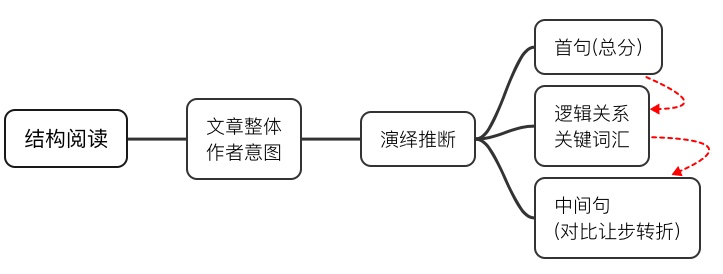
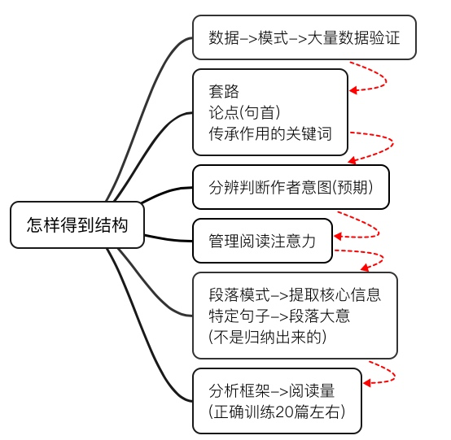

# GRE自然阅读法VS结构化阅读
[TOC]

GRE/GMAT考试的阅读文章取材于学术期刊与杂志，是学术文章的高度浓缩版，而出题又是针对学术推理本身而不是专业背景知识，因此，GRE/GMAT阅读需要有特别的准备方法，我称之为`“结构化阅读法”`。 

##自然阅读法

### 自然阅读-推论1
结构化阅读的方法首先不同于自然阅读法。所谓**自然阅读法，是指通过认识单词，尤其是生词以及专业名词，来理解短语和句子，进而理解段落和整篇文章**。这种方法的`一个必然推理`是，**阅读之所以不好，是因为单词量不够**。支持这个观察的事实是：总是在学术文章中遇到不认识的单词，所以阅读当然就不好。但是，GRE/GMAT阅读常考的逻辑关系，重心不在生词上。 

###自然阅读-推论2
自然阅读的`另外一个推论`是，**单词即使足够，句子不理解也不行，因此需要恶补英文语法以及长难句**。长难句分析当然是重要的，它的主要作用在于克服长句阅读的心理恐惧。但人们常常把长难句分析变成语法分析，结果长句的语法是清楚了，该句的核心意思却还不清楚。诚然，由while, whereas, although等词所引导的句子，句子本身的核心就在其对比中，但对于其他的长句，它们的核心意思却不是孤立表达于该句本身；事实上，并不存在一个惟一判断标准，来确定到底什么语法成分决定了句子最重要的信息。相反，长句的核心是在一个语境中也就是在上下句的相互联系中存在，因此是在写作者的意图中，而不是在句子的语法中存在。 

### 自然阅读-推论3
自然阅读法的`第三个说法`是，**多读就足以练好阅读**。多读的说法听起来当然不错；问题在于效率。考生需要在很短的时间之内训练出解题能力，为此需要训练对解题常考逻辑关系的理解。除了时间的限制，多读作为一种解决方案的缺陷还在于，也许多读是从来解决不了核心问题的。这个结论令人震惊，但却是事实。考虑两种情况：1. 读了50篇GRE/GMAT文章，答案都记住了，文章的翻译也看了，背景知识也查了，花了很多心思去记忆；2. 读了20篇GRE/GMAT文章，文章的句子之间的逻辑关系都分析清楚了，甚至可以跟考友讲明白。哪种情况下，考生更容易在GRE/GMAT考试中取得好成绩？答案不会令掌握学术英文思维的人惊讶：第二种。为什么呢？==GRE/GMAT阅读是以英文为基础的学术逻辑考试，不是以专业背景为噱头的歧视非此专业考生的考试。背景知识与文章翻译，统统是不必要的，虽然翻译若干篇可以让译者本人确定自己的确是明白了一些。==主张多读的朋友要仔细了：多读永远正确，但我们需要知道自己读的时候以什么为重心。学术文章阅读的重点是体现于上下句和上下段的逻辑推理，而不是每个孤立的句子内部的孤立的生词或专业名词。在错误的道路上奔跑，勤奋得令人崩溃。

### 自然阅读-推论4
自然阅读法的`第四个常见说法是多记`，**记住的文章信息越多，做题就做得越好**。这也是一个符合直觉的错误策略：一篇文章所有单词的总和也不等于是文章的核心信息；事实上，多记是记不住所有单词的，能够在2-3分钟阅读一篇文章以后记住的只能是认知上敏感的生词，比如生词，或者最后几个词。

### 自然阅读-推论5
自然阅读法的`第五个也是最后一个误区是读懂`。**有时读者恰好熟悉所读篇目的基本背景，结果就会带着自己的知识去对应和理解、有时甚至不惜以自己掌握的既有知识来扭曲文章中的逻辑链条**。阅读考查的是作者写了一些什么和怎么写的；而不是考读者认为某个问题是怎么样的。因此，读者在阅读学术文章时，不能先行带入自己的知识。读得越懂，在做题时还可能越不仔细，放弃回原文定位，错题反而比那些没有读懂的文章的错题更多，这也就并不奇怪了。 

## 结构化阅读法

将以上自然阅读法的五个问题一一取非，就是结构化阅读法的基本立场：

* 认识单词不等于理解文章；
* 读懂长句不等于把握逻辑结构；
* 多读不足以把握文章逻辑，把握文章甚至不必以篇数取胜；
* 阅读文章记忆的标靶要集中于少数目标；
* “读懂”往往带来理解偏差(带入自己的背景知识过多)。

虽然由于自然阅读法是人类认知配置的基本阅读“方法”，因此很难消除，也由于中国的学术传统中缺乏处理科学推理的思维方式，再加上以往的中文阅读的纠缠于字词本身的传统，更增加了改变视角的难度，但是，掌握了结构逻辑分析的方法，好处是巨大的，受益是终生的，值得所有优秀的青年学子尝试。 
　　
**GRE/GMAT结构化阅读解决的主要问题是掌握学术文章中的逻辑思路**。逻辑思路不会直接在文章中用实际意义的词汇、尤其生词来表达，而是用一些基本的套路词，以及学术推理的常用词汇，这些词汇在几乎任何一篇文章中都是存在的。这一主张适应于GMAT、GRE、LSAT的考试文章，也许在经过一定调整后，也适应于所有英文的学术文章。 
　　
与通常从单词基础、到句子理解、再到段落和文章的中心大意的猜测和回忆这样的从下到上的阅读路径相反，结构化阅读是从上到下的取向。这种方法从文章的整体和写作意图出发，以演绎的方式，推断和推测段落的结构关系，再从段落的首句，按照总分结构的思维，推断和推测段内若干句子的逻辑关系和词汇提炼的核心，再到段内的中间句子层面，仅仅看重那些由对比和让步转折等语言形式写成的句子。 
　　
这种思路与通常的阅读“方法”的对立，不是它存在的原因，而是它本身的一个副产品。**结构法之所以先从文章整体出发，是因为学术文章的主题是先行的。作者先有了写作的基本图像，然后才展开写作**。阅读者虽然不能像写作者本人那么清楚，但是至少可以按图索骥，找到文章的核心路线图。自然阅读法好像一个人闯进了单词的密林，然后陷在了沼泽地。结构阅读法好像一个人带着地图和指南针走进了有时明亮有时幽深的树林，沿着最直的道路前进，顺利抵达终点，然后向树林外的人讲述旅途的精彩。明亮的地带是结构性的句子，包括首末句、转折句和态度句，幽深的地带是专业细节句子，尤其是那些专属于某个学科的纯证据描述，甚至包括专业名词以及在中间句子出现的哪怕是不认识的动词和形容词。 

### 如何得到文章结构

怎么得到文章的结构呢？结构不是从单词的归纳得来，而是预先断定的写作模式。在分析GRE/GMAT阅读的学术文章时，我们似乎武断地假定文章存在相对稳定的写作结构，然后将此结构强加于所要阅读的文章之上。90%的文章都符合这些模式中的这种或那种，10%的文章是其中的若干种的变化组合。所以，这种方法是读者先形成对于学术文章的逻辑结构方面的一套假说，然后将此假说应用于具体文章的事实。 
　　
结构化阅读的发现过程本身也符合科学方法的原则。首先，随机找出若干GRE/GMAT真题的阅读文章，然后，分析是否可以归为几种模式，这是形成结构假说的过程，接着，将这些有限的模式应用于更多的文章，验证是否适用，如果不是，则根据例外情况来修正最初的结构假说。我在研究足够多量的文章以后发现，GMAT, GRE, LSAT阅读真题的文章都适应于我们提出的结构化假说。所以，我们一开始似乎是在武断的决定，文章以及段落分别存在某几种结构模式，但然后我们的推测得到了验证，假说(hypothesis)变成了关于学术英文的逻辑结构的理论(theory)。这是从数据到模式到更多数据验证的分析过程。 
　　
**通常人们认为模式是八股，但这个明显带有贬义的词实际上是指，文章的中心主题是为了证明一个意识形态的命题，为此采用特定的起承转合式的写作程序、甚至语言表达形式**。写作遵循一定程序，并不必然意味着成为八股；一个合理的操作流程，可以极大地提升沟通的效率。而语言表达方面的重复，当然对于任何文章都是不好的，尤其是当其中的语句空洞无物的时候。但在现代学术英文当中，主题都是活生生的事实，推理是严格的钢铁般的逻辑，不存在八股的问题。有时人们也会说模式就是套路。套路词当然是存在的，而套路本身只是文章的建造框架，文章本身的核心词毕竟还是与套路词有差别的，虽然它们往往与套路词同时出现在一个句子中。所以，模式不只是套路，而是还要包括主线词汇，这些词汇往往出现在段落首句的论点中。 
　　
源于数据分析方法得到的文章结构模式，是反复出现于各篇文章中的、确定的、易于识别的词汇，不只是每篇文章都会不同的专业概念本身，也不只是那些表示起承转合的词汇本文是，比如however, but, on the other hand, alternative，而是起承转合词加上由各个起承转合句里相互关联的核心词。通过这些词汇，读者很容易分辨和判断作者的主旨和意图，从而对文章后续内容形成特定的预期，然后按照这个预期去管理自己的阅读注意力。在段落的层面，模式则体现为特定的论点构成方式，这是构成方式本身也有它确定的词汇，通过这些词汇，读者也能预期段内的写作方式，并按照这些段落写作模式的规则来相应的提取核心信息，而不是企图全段每个单词读遍，然后归纳段落中心大意。中心大意不是归纳出来的，而是直接断定会出现在首句或段中转折句的；在多数时候，中心大意的判断甚至不以读完整段所有句子为前提，而是直接从特定的句子得出。 
　　
结构化阅读法有两个方面。`第一个方面` **是从数据到模式以形成结构假说是研究的过程，以上已经描述**；`第二个方面` **是从结构假说然后演绎出具体逻辑关系，这是考生学习的过程**。考生不必重复研究者发现这套方法的过程，只需要学会如何应用结构化阅读就可以了。 
　　
高效率的准备程序是从分析开始，到应用结束。考生只要先了解关于结构化阅读的抽象理论，应用这些理论实际分析20篇真题文章，写出每篇文章句子之间的关系，就能掌握整套方法。由于文章、段落还是句子的结构模式分别只有3-5种，考生在分析了20篇文章、60多个段落、250个句子以后，每种结构也许会分别重复5次、15次、50次。重复是重要的，积累必要的阅读量当然是分析的第一步，这是数据搜集的步骤，没有数据，也就不会存在模式。只有量当然也是不够的：正如只有数据，没有数据分析的架构，数据只是一堆分散的、毫无意义的数字而已，同样，只是读过很多文章段落和句子，没有分析结构的框架，那些文章段落和句子就依然是分散的、缺乏联系的内容，不会进入长期记忆，过了几天就会忘记。所以，分析框架和必要的阅读的量，两者缺一不可。在做过这20篇文章及其中的段落句子之间的关系的细致扎实的分析以后，考生就基本上明白了结构模式是怎样一回事，接下来就可以应用这些抽象的、但是依然可以操作的理论，去分析任何新的GRE/GMAT文章了。 
　　
由于结构化阅读遵循的是学术研究的思维模式，如果考生完全不了解学术方法，在学习学术英文的逻辑结构时，会有观念上的不适应，因为这种方法本身违背直觉，甚至有些考生会对分析逻辑结构有抵触情绪，因为从前受到错误的阅读方法的误导。人们常见的疑问是：难道这些模式就是学术文章的所有模式？难道就没有文章不存在模式吗？或者，模式是死的，文章是活的，万一遇到的文章不符合这些模式怎么办？对这些问题，我相信不仅是一个备考的问题，而且是思维方式的转换问题。把这些问题换一个面目会更好理解它们的实质：物体的运动真的存在规律吗？难道就没有什么东西不符合这些规律？确实，石头飞滚，苹果落地，导弹发射，飞船离开地球，行星的运动，这个世界的物理对象丰富多彩，但是，如此多变的现象却都符合牛顿力学的基本原则。从几条有限的假说出发，就能推演出人类所看到的几乎所有宏观物理对象的具体运动，这是科学的假说演绎法的威力。我们希望，结构化阅读中提供的模式也能模仿物理学的这种伟大创造，为变化万千的英文学术文章提供一个统一的操作程序，指引写作者写出结构井然的文章，指引阅读者读出文章的逻辑意义。逻辑结构也许不是变来变去的，因此并不那么活泛，但是，学术英文的逻辑结构是生存法则，不符合这些原则的学术文章都在学术交往中慢慢被淘汰了。而即便这些逻辑结构只有有限的几种模式，它们所能容纳的文章的题材、依据它们所能写出的文章，也是浩如烟海、丰富多彩、精彩绝伦。事实上，读懂逻辑线索，才是真正读懂学术文章。如果连论证的过程都不明白，只是认识几个单词，然后按照自己的偶然感受揣测作者的意图，那么，说读懂是说笑了。 
　　
我相信，为了理解GRE/GMAT阅读文章的逻辑思维，多了解一些关于学术文章基本的写作方法是必要的。英文维基百科里关于scientific method以及scientific revolution的条目，非常值得一读。如果有任何关于科学方法论（scientific method）的课程都值得去听，任何讨论critical thinking的书籍也值得去读(比如Moore and Parker写的Critical Thinking一书第九版的chapter 2, two kinds of reasoning, chapter 11, causal explanation)。最后，牛津出版的写作指南（Oxford Essential Guide to Writing）的第三部分专门讨论段落的写作模式，对于分析阅读学术类文章也有极大的帮助。我认为，以上三类材料是掌握学术英文分析的必要基础，对于从未接触过学术逻辑思维的考生也许是特别有益的。 
　　
在考生准备阅读的材料方面，真题当然是最好的，准备时间比较短的考生，建议只适用真题。如果没有太多或者根本没有真题，则Scientific American网站上的文章是值得读的。至于新闻类的英文报刊杂志，都不需要了，因为GRE/GMAT的阅读考试是为了将来到美国念研究院的同学钻研学术做准备。 
　　
本文主要讨论了通常理解的阅读方法与把握逻辑结构为主的阅读法的区别，并由此指出，学习GMAT阅读主要是学习以英文为基础的逻辑分析。由于阅读考题通常聚焦于段落之间、句子之间的逻辑关系，所以，学术英文的逻辑结构的理解，对于快速提高GRE/GMAT阅读的解题能力，极为重要。考生在有了基础的6000-8000词汇量和基本的长句阅读经验以后，就应把复习准备的主要精力，80%的精力，放在分析逻辑结构以及依据逻辑结构解题的重点上。

陈虎平，2009-12-15 

注：该文原题为GMAT阅读方法论，但GMAT与GRE阅读的方法完全一样，所以可以应用于GRE。现改名为GRE/GMAT阅读方法论。