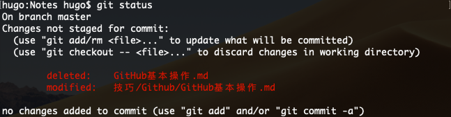

# Git基本操作
[TOC]

## Git文件操作

### 删除文件

在GitHub上只能删除仓库, 不能删除文件或者文件夹, 所以只能用命令来解决.

1. 先在本地删除要删除的文件
2. 在Terminal中执行下面的命令


```powershell
$ git add * //把本地仓库文件上传到缓存
$ git commit -m "del" //把第一步上传到缓存的东西上传到本地仓库, 其中“del”是操作标识, 内容随便填, 方便用户观看
$ git push origin master //把本地仓库的文件上传到远程仓库
```

### 上传修改过的文件

```powershell
$ git status //显示更改过的文件及其路径以及新文件
$ git add file_path // 将修改过的文件上传到缓存
$ git commit -m "message"
$ git commit -m "message" file_path1 file_path2 //对指定文件修改进行标注
$ git push origin master 
```

