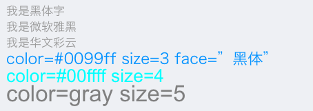

# Typora使用技巧

## 文字格式设置

通过html命令对文字进行一些设置

```html
<font face="黑体">我是黑体字</font>
<font face="微软雅黑">我是微软雅黑</font>
<font face="STCAIYUN">我是华文彩云</font>
<font color=#0099ff size=3 face="黑体">color=#0099ff size=3 face="黑体"</font>
<font color=#00ffff size=4>color=#00ffff size=4</font>
<font color=gray size=5>color=gray size=5</font>
```

具体效果如下:



参考: [CSDN markdown 文字设置](https://blog.csdn.net/thither_shore/article/details/52181464)